# 🏗️ Hungry Harbor — Architecture Document

> **Version**: 1.0  
> **Last Updated**: June 28, 2026  
> **Project**: Hungry Harbor — Online Food Ordering Platform

---

## Table of Contents

1. [Project Overview](#1-project-overview)
2. [Technology Stack](#2-technology-stack)
3. [High-Level System Architecture](#3-high-level-system-architecture)
4. [Directory Structure](#4-directory-structure)
5. [Application Layer Architecture](#5-application-layer-architecture)
6. [Route Groups & Page Hierarchy](#6-route-groups--page-hierarchy)
7. [API Layer Architecture](#7-api-layer-architecture)
8. [Authentication & Authorization](#8-authentication--authorization)
9. [Database Architecture](#9-database-architecture)
10. [Payment Processing Pipeline](#10-payment-processing-pipeline)
11. [Real-Time Communication (WebSocket)](#11-real-time-communication-websocket)
12. [State Management](#12-state-management)
13. [File Storage Architecture](#13-file-storage-architecture)
14. [Component Architecture](#14-component-architecture)
15. [Deployment Architecture](#15-deployment-architecture)
16. [Data Flow Diagrams](#16-data-flow-diagrams)

---

## 1. Project Overview

**Hungry Harbor** is a full-stack online food ordering web application that enables customers to browse a menu, add items to a cart/wishlist, place orders with online payment, track their orders in real-time, and leave reviews. It also features a dedicated **Admin Control Panel** for shop owners to manage items, categories, orders, admins, and view business analytics.

### Core Features

| Feature | Description |
|---|---|
| **User Authentication** | Credentials-based and Google OAuth sign-in via NextAuth.js |
| **Menu Browsing** | Browse food items by categories with search, filtering, and sorting |
| **Cart & Wishlist** | Add/remove items, stock validation before checkout |
| **Online Payment** | Razorpay payment gateway with webhook-based capture and automated refunds |
| **Order Tracking** | Real-time order status updates via WebSocket (pending → accepted → ready → delivered) |
| **Reviews & Ratings** | Users can submit, update, and delete reviews with star ratings |
| **Notifications** | Real-time push notifications for order updates, delivered via Socket.io |
| **Admin Control Panel** | Dashboard with sales charts, order management, item CRUD, category management, admin management |
| **Shop Open/Close** | Owner can toggle shop availability; orders are blocked when the shop is closed |
| **Forgot Password** | OTP-based password reset flow via email (currently disabled for security) |

---

## 2. Technology Stack

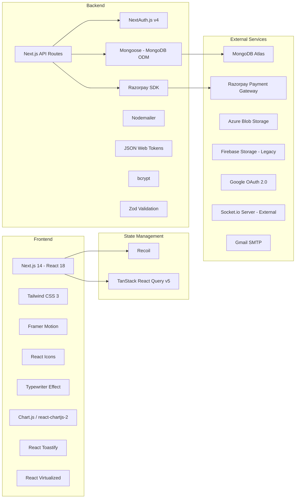

### Dependency Summary

| Category | Technology | Version | Purpose |
|---|---|---|---|
| **Framework** | Next.js | 14.1.0 | Full-stack React framework (App Router) |
| **UI** | React | 18.x | Component-based UI |
| **Styling** | Tailwind CSS | 3.3.x | Utility-first CSS |
| **Animation** | Framer Motion | 11.x | Page/component animations |
| **State** | Recoil | 0.7.7 | Client-side global state |
| **Data Fetching** | TanStack React Query | 5.18.x | Server state caching & synchronization |
| **Auth** | NextAuth.js | 4.24.x | Authentication (Credentials + Google) |
| **Database** | Mongoose | 8.1.x | MongoDB ODM |
| **Payment** | Razorpay | 2.9.x | Payment gateway integration |
| **Validation** | Zod | 3.22.x | Runtime schema validation |
| **Real-time** | Socket.io-client | 4.7.x | WebSocket client |
| **Charts** | Chart.js | 4.4.x | Analytics charts |
| **Storage** | @azure/storage-blob | 12.33.x | Image uploads to Azure |
| **Email** | Nodemailer | 6.9.x | Transactional emails |

---

## 3. High-Level System Architecture

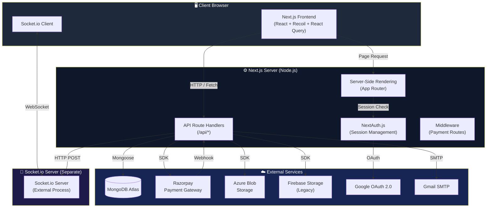

### Key Architectural Decisions

1. **Monolithic Full-Stack**: The application uses Next.js as both the frontend and backend, eliminating the need for a separate API server.
2. **Separate Socket Server**: Real-time communication is handled by an **external Socket.io server** process, communicated with via HTTP POST from the Next.js API routes and WebSocket from the client.
3. **Webhook-Driven Payments**: Razorpay payment confirmations arrive via webhook (`POST /api/payment/payment-capture`), decoupling payment processing from the user's session.
4. **Database Transactions**: Critical operations like order creation and payment capture use MongoDB transactions (`startSession()` / `commitTransaction()`) to ensure data consistency.

---

## 4. Directory Structure

```
hungry-harbor/
├── .dockerignore
├── .env.example               # Environment variable template
├── .env.local                 # Local environment variables (gitignored)
├── .gitignore
├── Dockerfile                 # Docker containerization config
├── ER_DIAGRAM.md              # Database ER diagram documentation
├── README.md
├── jsconfig.json              # Path alias config (@/ → src/)
├── next.config.mjs            # Next.js configuration
├── package.json
├── postcss.config.js
├── tailwind.config.js
├── public/
│   ├── images/                # Static image assets
│   ├── next.svg
│   └── vercel.svg
└── src/
    ├── middleware.js           # Next.js edge middleware
    ├── app/                   # Next.js App Router (pages + API)
    │   ├── layout.js          # Root layout (providers)
    │   ├── error.js           # Global error boundary
    │   ├── globals.css        # Global styles
    │   ├── favicon.ico
    │   ├── (auth-page)/       # Auth route group
    │   ├── (web-page)/        # Customer-facing route group
    │   ├── (owner-page)/      # Admin control panel route group
    │   └── api/               # API route handlers
    ├── components/            # Reusable UI components (20 directories)
    ├── config/                # Service configurations
    ├── models/                # Mongoose schemas (11 collections)
    ├── store/                 # Recoil atoms & selectors
    └── util/                  # Server-side utility functions
```

---

## 5. Application Layer Architecture

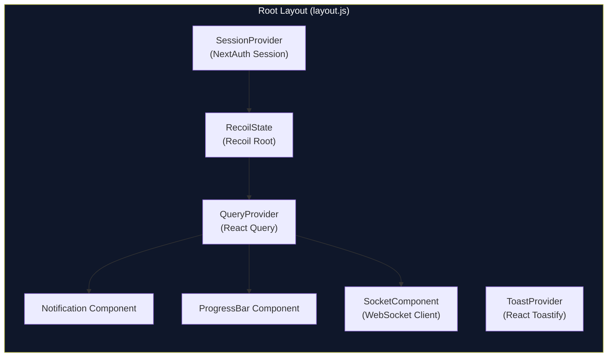

### Provider Hierarchy (Root Layout)

The root `layout.js` wraps the entire application in a carefully ordered provider hierarchy:

```
<html>
  <body>
    <SessionProvider>          ← NextAuth session context
      <RecoilState>            ← Recoil state management root
        <QueryProvider>        ← TanStack React Query client
          {children}           ← Page content
          <Notification />     ← In-app notification overlay
          <ProgressBar />      ← Global loading progress bar
          <SocketComponent />  ← WebSocket connection manager
        </QueryProvider>
      </RecoilState>
    </SessionProvider>
    <ToastProvider />          ← Toast notification container
  </body>
</html>
```

---

## 6. Route Groups & Page Hierarchy

Next.js App Router **route groups** (parenthesized folders) are used to organize pages without affecting URL structure. The project has three major route groups:

```mermaid
graph TB
    ROOT["/"] --> AUTH_GROUP["(auth-page)<br/>Public Auth Pages"]
    ROOT --> WEB_GROUP["(web-page)<br/>Customer Pages"]
    ROOT --> OWNER_GROUP["(owner-page)<br/>Admin Pages"]
    ROOT --> API_GROUP["api/<br/>API Routes"]

    AUTH_GROUP --> LOGIN["/login"]
    AUTH_GROUP --> SIGNUP["/signup"]
    AUTH_GROUP --> FORGOT["/forgot-password"]

    WEB_GROUP --> HOME["/ (Home Page)"]
    WEB_GROUP --> ITEMS_LIST["/items"]
    WEB_GROUP --> ITEM_DETAIL["/items/[id]"]
    WEB_GROUP --> PRIVACY["/privacy-policy"]
    WEB_GROUP --> TERMS["/terms-and-conditions"]
    WEB_GROUP --> REFUND_PAGE["/refund-and-cancellation"]

    WEB_GROUP --> AUTH_CHECK["(auth-check)<br/>Requires Login"]
    AUTH_CHECK --> CART["/cart"]
    AUTH_CHECK --> WISHLIST["/wishlist"]
    AUTH_CHECK --> ORDERS["/orders"]
    AUTH_CHECK --> ORDER_SUMMARY["/orders/order-summary"]
    AUTH_CHECK --> PROFILE["/profile"]
    AUTH_CHECK --> CHANGE_PASS["/profile/change-password"]
    AUTH_CHECK --> NOTIFICATIONS_PAGE["/notifications"]

    OWNER_GROUP --> CP["control-panel/<br/>Requires Admin"]
    CP --> DASHBOARD["/control-panel/dashboard"]
    CP --> CP_ITEMS["/control-panel/items"]
    CP --> REMOVED["/control-panel/items/removed-items"]
    CP --> CP_ORDERS["/control-panel/orders"]
    CP --> ADMINS["/control-panel/admins"]

    style ROOT fill:#1e293b,color:#fff
    style AUTH_GROUP fill:#7c3aed,color:#fff
    style WEB_GROUP fill:#059669,color:#fff
    style OWNER_GROUP fill:#dc2626,color:#fff
    style AUTH_CHECK fill:#0369a1,color:#fff
    style API_GROUP fill:#d97706,color:#fff
```

### Route Group Details

| Route Group | Layout | Auth Guard | Description |
|---|---|---|---|
| `(auth-page)` | Minimal layout | None (public) | Login, Signup, Forgot Password pages |
| `(web-page)` | `Navbar` layout (TopBar + LeftBar + Footer) | None for public pages | Customer-facing storefront |
| `(web-page)/(auth-check)` | Inherits `Navbar` | Server-side session check — redirects if not logged in | Cart, Orders, Wishlist, Profile, Notifications |
| `(owner-page)` | Admin check layout | Server-side `isAdmin` check — blocks non-admins | Admin control panel |
| `(owner-page)/control-panel` | `ControlPanelNavbar` layout | Inherited from parent | Dashboard, Items, Orders, Admins management |

---

## 7. API Layer Architecture

The API layer is built using **Next.js Route Handlers** (`route.js` files inside `src/app/api/`). Each endpoint exports named HTTP method handlers (`GET`, `POST`, etc.).

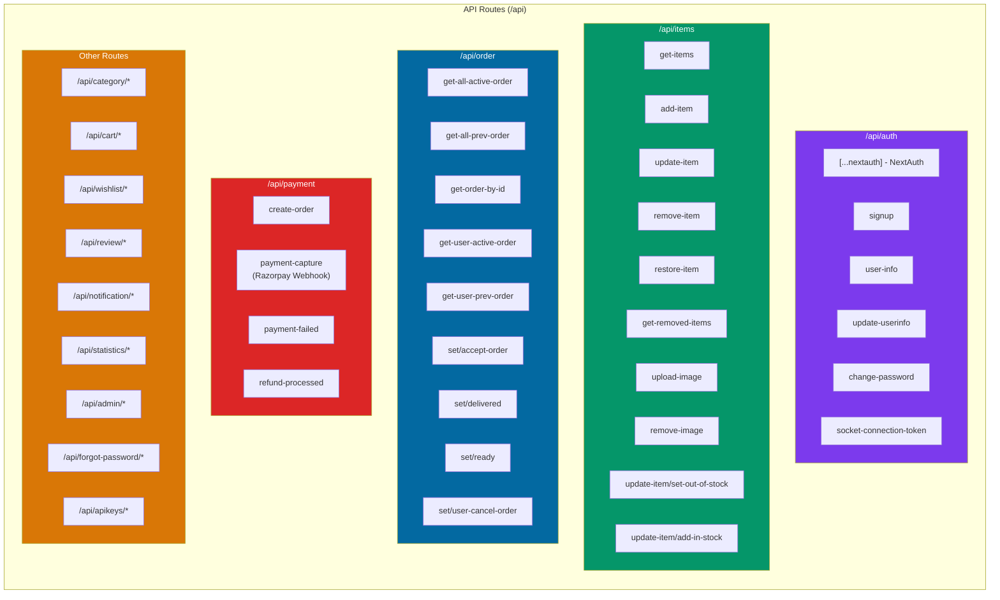

### Complete API Endpoint Inventory

| Domain | Endpoint | Method | Auth | Description |
|---|---|---|---|---|
| **Auth** | `/api/auth/[...nextauth]` | GET/POST | — | NextAuth.js handler (Google + Credentials) |
| | `/api/auth/signup` | POST | — | User registration |
| | `/api/auth/user-info` | GET | User | Fetch logged-in user profile |
| | `/api/auth/update-userinfo` | POST | User | Update name, phone, address, avatar |
| | `/api/auth/change-password` | POST | User | Change password |
| | `/api/auth/socket-connection-token` | GET | User | Generate JWT for socket auth |
| **Items** | `/api/items/get-items` | GET | — | Fetch all active menu items |
| | `/api/items/add-item` | POST | Admin | Add new menu item |
| | `/api/items/update-item` | POST | Admin | Update item details |
| | `/api/items/update-item/set-out-of-stock` | POST | Admin | Set item out of stock |
| | `/api/items/update-item/add-in-stock` | POST | Admin | Add stock to item |
| | `/api/items/remove-item` | POST | Admin | Soft-delete item |
| | `/api/items/restore-item` | POST | Admin | Restore soft-deleted item |
| | `/api/items/get-removed-items` | GET | Admin | Fetch soft-deleted items |
| | `/api/items/upload-image` | POST | Admin | Upload image to Azure Blob |
| | `/api/items/remove-image` | POST | Admin | Delete image from Azure Blob |
| **Category** | `/api/category/get-all-categories` | GET | — | List all categories with item counts |
| | `/api/category/add-category` | POST | Admin | Create new category |
| | `/api/category/remove-category` | POST | Admin | Delete category |
| **Cart** | `/api/cart/get-cart-items` | GET | User | Fetch user's cart |
| | `/api/cart/add-to-cart` | POST | User | Add item to cart |
| | `/api/cart/remove-from-cart` | POST | User | Remove item from cart |
| | `/api/cart/validate-stock` | POST | User | Check stock availability |
| **Wishlist** | `/api/wishlist/get-wishlist-items` | GET | User | Fetch user's wishlist |
| | `/api/wishlist/add-to-wishlist` | POST | User | Add item to wishlist |
| | `/api/wishlist/remove-from-wishlist` | POST | User | Remove item from wishlist |
| **Order** | `/api/order/get-user-active-order` | GET | User | Fetch user's active orders |
| | `/api/order/get-user-prev-order` | GET | User | Fetch user's order history |
| | `/api/order/get-all-active-order` | GET | Admin | Fetch all active orders |
| | `/api/order/get-all-prev-order` | GET | Admin | Fetch all past orders |
| | `/api/order/get-order-by-id` | POST | Admin | Fetch single order details |
| | `/api/order/set/accept-order` | POST | Admin | Accept a pending order |
| | `/api/order/set/delivered` | POST | Admin | Mark order as delivered |
| | `/api/order/set/ready` | POST | Admin | Mark order as ready |
| | `/api/order/set/user-cancel-order` | POST | User | Cancel an order |
| **Payment** | `/api/payment/create-order` | POST | User | Create Razorpay order |
| | `/api/payment/payment-capture` | POST | Webhook | Razorpay payment success webhook |
| | `/api/payment/payment-failed` | POST | Webhook | Razorpay payment failure webhook |
| | `/api/payment/refund-processed` | POST | Webhook | Razorpay refund completion webhook |
| **Review** | `/api/review/get-all-review` | GET | — | Fetch all reviews for an item |
| | `/api/review/get-user-review` | GET | User | Fetch user's review for an item |
| | `/api/review/submit-review` | POST | User | Submit a new review |
| | `/api/review/update-review` | POST | User | Update existing review |
| | `/api/review/remove-review` | POST | User | Delete a review |
| **Notification** | `/api/notification/get-notification` | GET | User | Fetch user's notifications |
| | `/api/notification/get-unread-noti-count` | GET | User | Get unread notification count |
| | `/api/notification/mark-read` | POST | User | Mark notification as read |
| **Statistics** | `/api/statistics/get-stats` | GET | Admin | Fetch sales analytics (last 2 months) |
| **Admin** | `/api/admin/get-admins` | GET | Admin | List all admins |
| | `/api/admin/add-admin` | POST | Admin | Add new admin |
| | `/api/admin/remove-admin` | POST | Admin | Remove admin |
| **Forgot Password** | `/api/forgot-password/get-otp` | POST | — | Send OTP email (currently disabled) |
| | `/api/forgot-password/verify-otp` | POST | — | Verify OTP |
| | `/api/forgot-password/reset-password` | POST | — | Reset password |

---

## 8. Authentication & Authorization

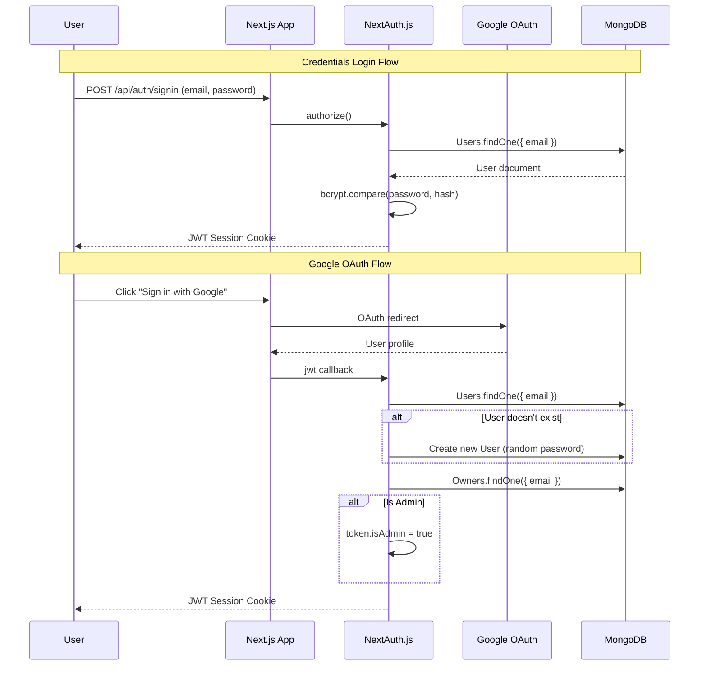

### Auth Architecture Details

- **Providers**: Google OAuth 2.0 + Credentials (email/password)
- **Strategy**: JWT-based sessions (stateless)
- **Password Hashing**: bcrypt with 10 salt rounds
- **Input Validation**: Zod schema validation on login
- **Admin Detection**: On every JWT callback, the system checks the `Owners` collection to set `token.isAdmin`
- **Google Auto-Registration**: First-time Google users are automatically created in the `Users` collection with a random password

### Authorization Layers

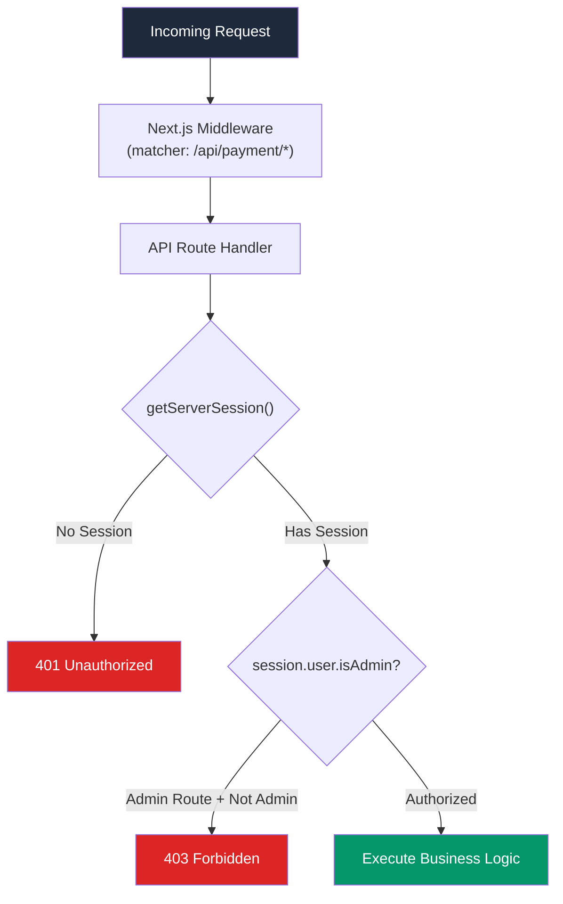

| Layer | Mechanism | Scope |
|---|---|---|
| **Middleware** | `src/middleware.js` (currently empty body) | `/api/payment/*` routes |
| **Server Layout Guards** | `getServerSession()` in layout.js | `(auth-check)` and `(owner-page)` route groups |
| **API Route Guards** | `getServerSession(authOptions)` in route handlers | Individual API endpoints |

---

## 9. Database Architecture

The application uses **MongoDB** as its primary database, accessed via **Mongoose ODM**. There are **11 collections**.

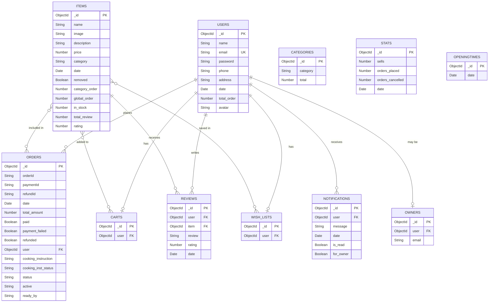

### Database Connection Pattern

The `mongoConnect()` utility in `src/config/moongose.js` implements a **singleton connection pattern**:
- Checks `mongoose.connection.readyState` before connecting
- Reuses existing connections across API route invocations
- Prevents connection pool exhaustion in serverless environments

### Order Status State Machine

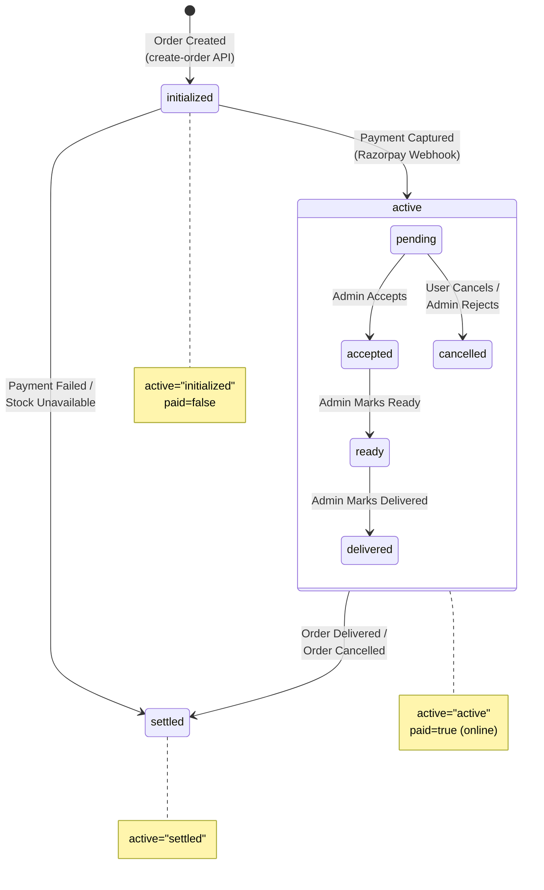

The `Orders` collection tracks two dimensions of state:
1. **`active`** field: Lifecycle stage (`initialized` → `active` → `settled`)
2. **`status`** field: Order progress (`pending` → `accepted` → `ready` → `delivered` or `cancelled`)

---

## 10. Payment Processing Pipeline

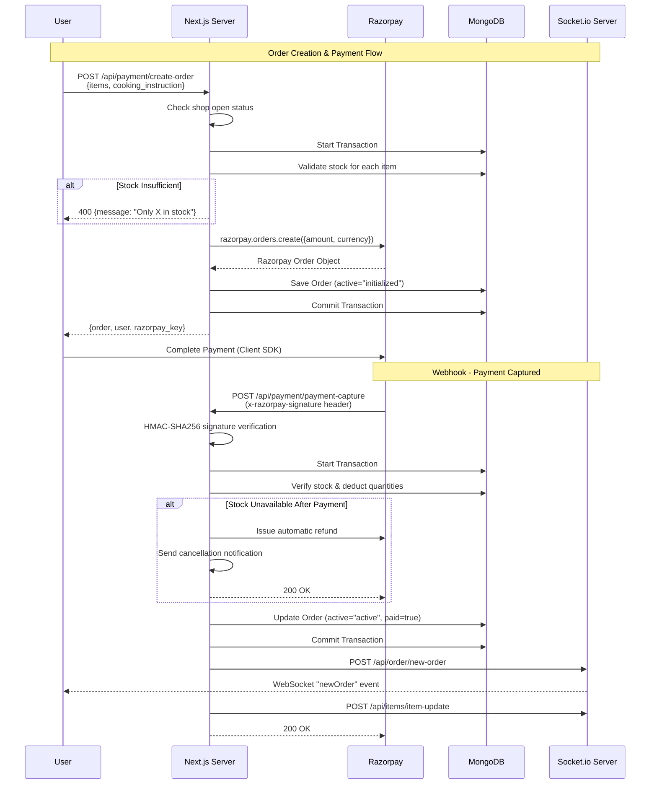

### Payment Security

| Mechanism | Description |
|---|---|
| **HMAC Verification** | Razorpay webhook payloads are verified using HMAC-SHA256 with `RAZORPAY_WEBHOOK_SECRET` |
| **DB Transactions** | Stock deduction and order updates are wrapped in MongoDB transactions |
| **Automatic Refunds** | If stock becomes unavailable between order creation and payment capture, a refund is automatically issued |
| **Always 200 OK** | The webhook handler always returns `200 OK` to prevent Razorpay from retrying |

---

## 11. Real-Time Communication (WebSocket)

The application uses a **separate Socket.io server** (external process) for real-time communication. The Next.js server communicates with it via HTTP, and the client connects directly via WebSocket.

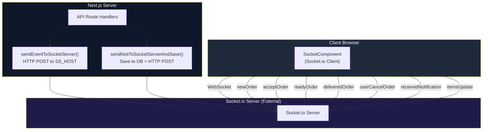

### Socket Events

| Event | Direction | Receiver | Purpose |
|---|---|---|---|
| `send-token` | Server → Client | User | Request auth token from client |
| `set-token` | Client → Server | Server | Authenticate WebSocket connection |
| `newOrder` | Server → Admin | Admin | New order notification |
| `acceptOrder` | Server → User | User | Order accepted/rejected update |
| `readyOrder` | Server → User | User | Order ready for pickup |
| `deliveredOrder` | Server → User | User | Order delivered confirmation |
| `userCancelOrder` | Server → Admin | Admin | User cancelled order |
| `receivedNotification` | Server → User/Admin | Both | Generic notification |
| `itemsUpdate` | Server → All | All | Menu item updated (triggers React Query invalidation) |

### Authentication Flow for Socket

1. Client connects to Socket.io server
2. Server emits `send-token`
3. Client fetches JWT from `/api/auth/socket-connection-token`
4. Client emits `set-token` with the JWT
5. Server verifies JWT and associates the socket with the user

---

## 12. State Management

The application uses a **dual state management** approach:

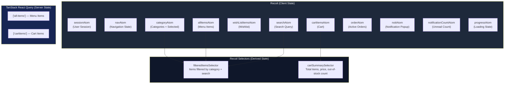

### State Management Philosophy

| Concern | Tool | Rationale |
|---|---|---|
| **Global UI State** | Recoil atoms | Navigation toggle, progress bar, notifications, search query |
| **Domain Data** | Recoil atoms + selectors | Items, categories, cart, wishlist, orders — with derived filtering/sorting |
| **Server Data Caching** | React Query | Automatic cache invalidation, background refetching (especially `all-items` and `cartitems`) |
| **Session State** | NextAuth + Recoil | Session fetched server-side, synced to Recoil `sessionAtom` for client access |

### Key Selectors

1. **`filteredItemsSelector`**: Filters items by `selectedCategoryAtom` and `searchAtom`, then sorts by `global_order` or `category_order`
2. **`cartSummarySelector`**: Computes `total_item`, `total_price`, and `out_of_stock` count from `cartItemsAtom`
3. **`categoryAtom` default selector**: Fetches categories on initialization and prepends an "ALL" virtual category with total count

---

## 13. File Storage Architecture

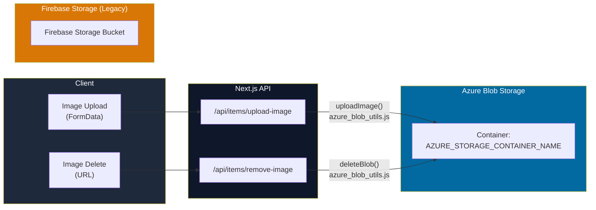

### Storage Details

- **Primary**: Azure Blob Storage — used for item image uploads
  - Images are stored with UUID-based unique filenames (`{name}-{uuid}.{ext}`)
  - Content type is set automatically based on file extension
  - Default item image: `https://hungryharbor.blob.core.windows.net/public/no-image.jpg`
  - Default avatar: `https://hungryharbor.blob.core.windows.net/public/Profile.png`
- **Legacy**: Firebase Storage — configuration still present but being replaced by Azure. The Firebase config is fetched dynamically from `/api/apikeys/firebase` for client-side access
- **Client Helpers**: `src/util/image_helper.js` provides `uploadImageClient()` and `deleteImageClient()` wrappers

---

## 14. Component Architecture

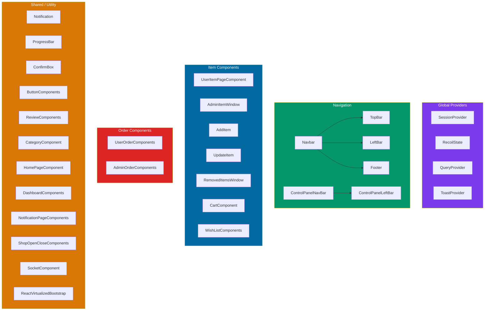

### Component Categories

| Category | Components | Purpose |
|---|---|---|
| **Providers** | `SessionProvider`, `RecoilState`, `QueryProvider`, `ToastProvider` | Wrap app in necessary contexts |
| **Navigation** | `Navbar`, `TopBar`, `LeftBar`, `Footer`, `ControlPanelNavBar`, `ControlPanelLeftBar` | Navigation chrome for customer and admin views |
| **Item Management** | `UserItemPageComponent`, `AdminItemWindow`, `AddItem`, `UpdateItem`, `RemovedItemsWindow` | Menu item display and CRUD |
| **Cart & Wishlist** | `CartComponent`, `WishListComponents` | Shopping cart and favorites |
| **Orders** | `UserOrderComponents`, `AdminOrderComponents` | Order tracking and management |
| **Reviews** | `ReviewComponents` | Star ratings and text reviews |
| **Dashboard** | `DashboardComponents` | Sales and order charts (Chart.js) |
| **Notifications** | `Notification`, `NotificationPageComponents` | Real-time popup + notification history page |
| **Utility** | `ProgressBar`, `ConfirmBox`, `ButtonComponents`, `CategoryComponent`, `ShopOpenCloseComponents` | Reusable UI elements |
| **Real-time** | `SocketComponent` | WebSocket connection lifecycle |

---

## 15. Deployment Architecture

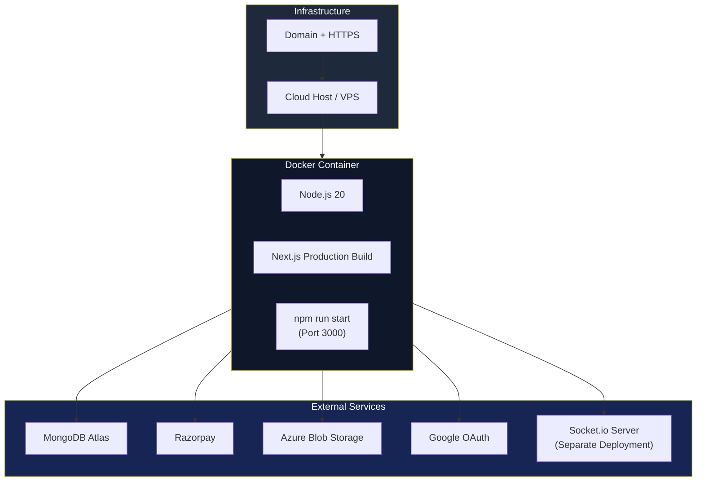

### Dockerfile Breakdown

```dockerfile
FROM node:20           # Base image
WORKDIR /app
COPY package*.json .   # Install dependencies first (layer caching)
RUN npm install
COPY . .               # Copy source
EXPOSE 3000            # Next.js default port
RUN npm run build      # Build production bundle
CMD ["npm","run","start"]  # Start production server
```

### Environment Variables

| Variable | Purpose |
|---|---|
| `NEXTAUTH_URL` | NextAuth base URL |
| `NEXTAUTH_SECRET` | JWT signing secret |
| `GOOGLE_CLIENT_ID` / `GOOGLE_CLIENT_SECRET` | Google OAuth credentials |
| `MONGO_URL` | MongoDB connection string |
| `RAZORPAY_KEY_ID` / `RAZORPAY_SECRET` | Razorpay API credentials |
| `RAZORPAY_WEBHOOK_SECRET` | Webhook signature verification |
| `AZURE_STORAGE_CONNECTION_STRING` | Azure Blob Storage access |
| `AZURE_STORAGE_CONTAINER_NAME` | Azure container name |
| `FORGOT_PASSWORD_KEY` | JWT secret for OTP tokens |
| `DEVELOPER` | Developer email (for owner notifications) |
| `PASS_CODE` | Socket server authentication |
| `SS_HOST` / `NEXT_PUBLIC_SS_HOST` | Socket.io server URL (server / client) |

---

## 16. Data Flow Diagrams

### User Ordering Flow (End-to-End)

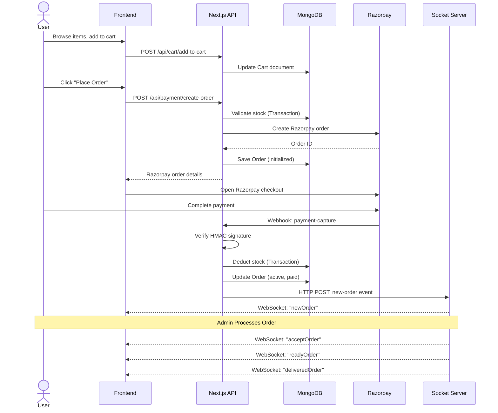

### Item Management Flow (Admin)

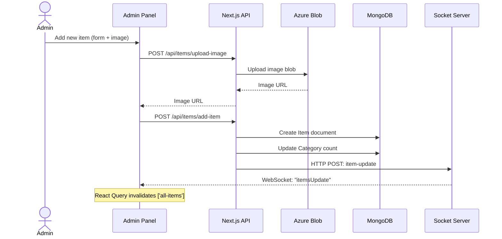

---

> **Document generated for**: Hungry Harbor v0.1.0  
> **Framework**: Next.js 14 (App Router) | **Database**: MongoDB | **Payment**: Razorpay | **Real-time**: Socket.io
