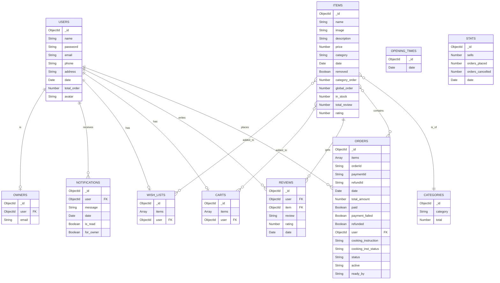

# Hungry Harbor Models ER Diagram

This document contains the Entity-Relationship (ER) diagram for the MongoDB database models used in the Hungry Harbor project, along with a short description of each model.

## ER Diagram

<!-- [![](https://mermaid.ink/img/pako:eNqtVm1v2jAQ_iuRP0MFKU0h31hLu2grTISt0oQUmfgIXhMbOQ6MAf99zgsQcKBoXT4Ecvf43vzc2WvkcwLIRiAeKQ4EjsbMUM93tzd0jc2mXudrYzB8TL9sYx5iH-IKxLD3w-m9ppCloLICsjEeusNRCpjhKu2r4372vjruWcja6A9GzpPz0B05g36KEuADXVT6Grz284Bpoc3fzqj34hpbXq9v0nhGvefB0OnlOI9PT0HlzH3OJKYsLmO03AOQcYWRXeaYECCe5BWQo_QPuHJq6_wjfQaTX-BLhxgeJQepKwVlgcFwBJpwjuN4yYWOhgjTUIfPONONqLgExPFB_oglGES9DqJ-Ek1AGJJLHHrKIQjdzAJLXIi3uxyLQr-bZFcIvDIUxaJYM5y5c0hF8qsImKzQCJgmjJQV76WEI54weVB-4jwEzJSPcpQHaebZm6oiQ4U-91_W7LNOYuXz6YsWss_5m_r1FBelSHxJObuI8WKJZaIX64wYK4sLqCgUJitvstrv2mlTfYidNMKBLiUQ-4LOjzMsNmMuqK-v8NW-BVysLm7nofYRX5RLX5jeGTllb6EOQj7RqV0oKVPl5v7bGfIIWFBYakqBpYr-pCF2U-Xdwp5nzF6TtksVl66Ip6KI-xDzufZvLVsd9RGxSjPxP_soRk5-SHygwPoM3Rs_Pqw-7iNSg_eoSS4wWx1mab_qiikXHl8yENpG7o_Ca_tYb7Uy008r_a3Xd_rP3sh5ucbFOb65o-41XCgCiSEMY02a9W3sZRcZck7rY-ar1XAhJlRDgaAE2WoIQw1FIBQJ1CfKwhsjOQM16JCt_hIs3sZozNI1c8x-ch7tlgmeBDNkT3EYq69knjoormF7qQB1QoiH9NhBdvO2kxlB9hr9RrbZtG46VqPZuL-9M1st696qoZVCtcybzp3ZaLRNy2pb5l17W0N_Mr-Nm3uz0261W-qxmm3TbNUQECq5eMnvgdl1cPsX_cT4lA?type=png)](https://mermaid.live/edit#pako:eNqtVm1v2jAQ_iuRP9MKUkhpvrGWdtFWmAhbpQkpMvERvCY2sh0Yo_z3OSFAwIGidfkQyN3je_NzZ69QyAkgF4F4oDgSOBkxSz_f_e7At97erq74yuoPHrIv15rFOARZgRh0f3jdlwyyEFRVQN6s-85gmAGmuEr74vmfg6-efxKysnr9offo3XeGXr-XoQSEQOeVvvovvU3AtNCW396w--xba36YWsiZwpTJMsZILgIlK4xsU8OEAAkUr4Ac5LfHlWNfbT6ypz_-BaHyiBVQspf6SlAWWQwnYAhnWMoFFyYaEkxjEz7lzDSi4xIg5V7-gBVYRL_2ol6ajEFYiiscB9ohCNPMHCtciNfbHItCv5tkRwi8tDSHEmkYzt15pCL5ZQJMVWgETFJGyor3UsIJT5naKz9xHgNm2kc5yr009xxMdJGhQr_xX9bssk6l9vn4xQg55PxV_waai0qkoaKcncUEUmGVmsU6Icba4hwqCoXJMhgvd7t23C8fYidNcGRKCchQ0NlhhsVmzAQNzRWh3reIi-XZ7dzXPuHzcukL01sjx-wt1FHMxya1CyVlutw8fD1BHgFzCgtDKbDS0R81xHaqvFvY04zZabJ2qeLSBfFUFHEX4mau_VvLVkd9QKzSTPzPPoqRszkFPlBgc4bujB-eRh_3kejBe9AkZ5hNZZD1q6mYcBHwBQNhbOSw-9QfeN3L-9hstTLTjyv9rdvzek_B0Hu-xMUpvvnDziVcKAKREMfSkOZ9K4P8pkJOaUPMQr0azsSEaigSlCBXD2GooQSEJoH-RHl4I6SmoAcdcvVfgsXrCI1YtmaG2U_Ok-0ywdNoitwJjqX-SmeZg-KetZMK0CeEuM-OHeQ2blq5EeSu0G_k2g3n-s6pN-q3Ny272XRunRpaalTTvr5r2fV623actmO32usa-pP7rV_f2nftZrupH6fRtm1tDwhVXDxvLnr5fW_9F5W67yE) -->

## Model Descriptions

* **Users (users):** Stores information about customers, including their name, contact details, authentication credentials, and total number of orders.
* **Items (items):** Represents the food or products available to order. Contains details such as name, description, price, category, stock availability, and ratings.
* **Orders (orders):** Records all customer purchases. Tracks the items bought, total amount, payment status, cooking instructions, and current order status (pending, accepted, delivered, cancelled).
* **Reviews (reviews):** Holds feedback and ratings provided by users for specific items.
* **Carts (carts):** Stores the current items and their quantities that a user intends to purchase.
* **WishLists (wish_lists):** Allows users to save favorite items for future reference without adding them to a cart immediately.
* **Owners (owners):** Links a specific user to restaurant owner privileges and stores their administrative email.
* **Notifications (notifications):** Keeps track of system or order-related messages sent to users or owners, including read status.
* **Categories (categories):** Maintains a list of food categories to group items logically and counts the total items in each.
* **OpeningTimes (openingtimes):** A simple model that currently tracks generic operational dates/times.
* **Stats (stats):** Aggregates business performance metrics such as total sales, orders placed, and orders cancelled over specific dates.
