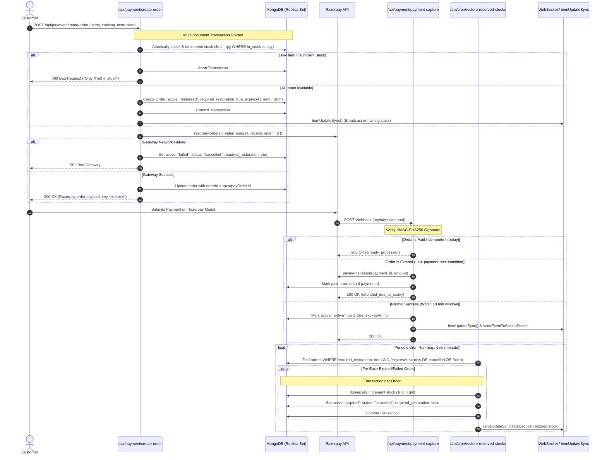
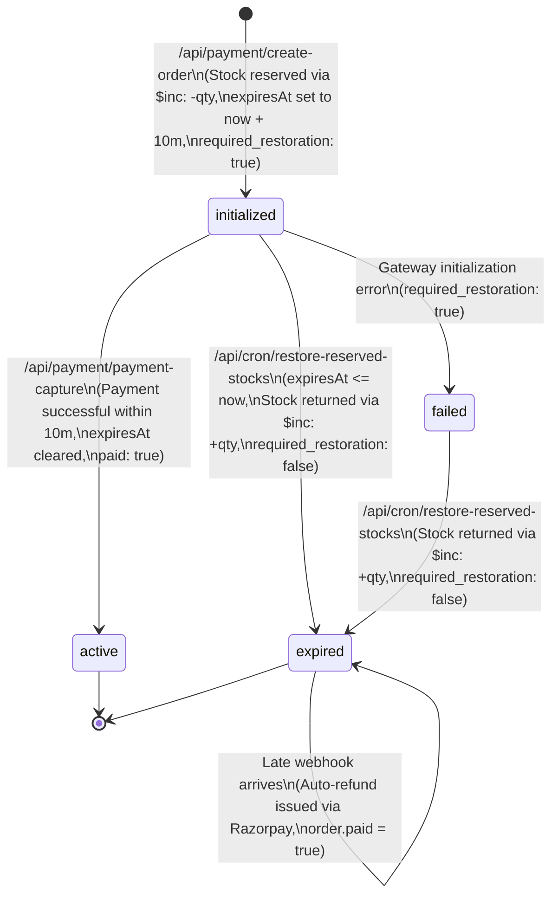

# Concurrency Handling & Inventory Reservation Architecture

This document provides a comprehensive technical breakdown of how **Hungry Harbor** manages high-concurrency ordering, inventory locking, race conditions, idempotency, and automated stock recovery across three critical routes:

1. **Order Initialization & Inventory Hold**: [`create-order/route.js`](./../src/app/api/payment/create-order/route.js)
2. **Webhook Verification & Idempotent Capture**: [`payment-capture/route.js`](./../src/app/api/payment/payment-capture/route.js)
3. **Automated Stock Restoration & Self-Healing Cron**: [`restore-reserved-stocks/route.js`](./../src/app/api/cron/restore-reserved-stocks/route.js)

---

## 1. High-Level Architecture & Lifecycle

The system utilizes an **In-Order Inventory Hold Strategy** paired with **ACID Database Transactions**, **Atomic Conditional Writes**, **Commit-Before-Network Calls**, and an **Eventual Consistency Compensation Cron**.



---

## 2. Deep-Dive: Concurrency Handling in Each Component

### A. [`create-order/route.js`](./../src/app/api/payment/create-order/route.js) — Atomic Stock Reservation

#### 1. Preventing Race Conditions & Overselling (Atomic Conditional Updates)
Traditional read-then-write patterns (`find()` then calculate then `save()`) introduce a **Time-of-Check to Time-of-Use (TOCTOU)** race condition when multiple users attempt to buy the same item concurrently.

Hungry Harbor avoids this by using **conditional atomic decrements**:
```javascript
const dbItem = await Items.findOneAndUpdate(
    { _id: itemId, in_stock: { $gte: requestedQty }, removed: { $ne: true } },
    { $inc: { in_stock: -requestedQty } },
    { session: db_session, new: true }
);
```
- **Filter Constraint `{ in_stock: { $gte: requestedQty } }`**: MongoDB evaluates the document match atomically. If 10 concurrent requests target 1 remaining item, only the first request matches the `$gte: 1` filter and decrements it to `0`. The remaining 9 requests fail to find a matching document and return `null`.
- **Cart-Level All-or-Nothing Guarantee**: If any single item in a multi-item order fails the stock check, the route aborts the MongoDB transaction:
  ```javascript
  if (outOfStockMessage) {
      await db_session.abortTransaction();
      db_session.endSession();
      return NextResponse.json({ ok: false, message: outOfStockMessage }, { status: 400 });
  }
  ```
  All items decremented prior in the same request are rolled back atomically.

#### 2. The "Commit-Before-Network-Call" Pattern
Holding database locks/transactions across long third-party network calls (like `razorpay.orders.create`) creates severe connection starvation and high transaction lock contention.

- **Mitigation**: The database transaction is **committed first**:
  ```javascript
  await orderData.save({ session: db_session });
  await db_session.commitTransaction();
  db_session.endSession();
  ```
- **Post-Commit Failure Protection**: If the subsequent Razorpay HTTP call fails or times out:
  ```javascript
  catch (gatewayErr) {
      await Orders.findByIdAndUpdate(createdOrderId, {
          $set: { active: "failed", status: "cancelled", required_restoration: true }
      });
      return NextResponse.json({ ok: false, message: "..." }, { status: 502 });
  }
  ```
  The order is flagged with `required_restoration: true`, allowing the background cron engine to asynchronously and safely release the reserved stock.

---

### B. [`payment-capture/route.js`](./../src/app/api/payment/payment-capture/route.js) — Webhook Idempotency & Late-Arrival Arbitration

Payment gateways deliver webhooks asynchronously and may retry notifications multiple times. The capture route implements robust concurrency and edge-case guards:

#### 1. Cryptographic Authentication
Every webhook is verified against the raw request body using HMAC-SHA256 before any database interaction:
```javascript
const shasum = createHmac('sha256', process.env.RAZORPAY_WEBHOOK_SECRET);
shasum.update(JSON.stringify(body));
const digest = shasum.digest('hex');
if (digest !== razorpaySignature) {
    return NextResponse.json({ ok: false, status: "invalid_signature" }, { status: 200 });
}
```

#### 2. Idempotency Gate (Duplicate Delivery Protection)
If Razorpay delivers duplicate webhooks for the same order, the idempotency check prevents duplicate fulfillment or state corruption:
```javascript
if (orderData.paid) {
    return NextResponse.json({ ok: true, status: "already_processed" }, { status: 200 });
}
```

#### 3. Late-Payment Arbitration & Auto-Refund (Critical Race Condition Window)
A classic concurrency challenge occurs when a customer keeps the payment modal open past the 10-minute reservation expiry window, during which the cleanup cron has already returned the stock to public inventory:

- **Condition**: `orderData.active === "expired" || (orderData.expiresAt && new Date() > orderData.expiresAt)`
- **Resolution**:
  1. The server refuses to fulfill the order (since inventory may have already been claimed by another buyer).
  2. The server programmatically triggers an immediate refund via Razorpay's refund API:
     ```javascript
     await instance.payments.refund(payment_id, {
         amount: Math.round(orderData.total_amount * 100),
         speed: "normal",
         receipt: orderData._id.toString(),
         notes: { reason: "Payment received after reservation expired." }
     });
     ```
  3. Records `orderData.paid = true` and `orderData.paymentId = payment_id` to prevent retry loops.
  4. Pushes a real-time WebSocket notification to the customer informing them of the automatic refund.

#### 4. Clean Order Confirmation
When captured within the valid reservation window:
- Sets `active: "active"`, `paid: true`, `status: "pending"`, and `expiresAt: null`.
- Because stock was already secured upfront in `create-order`, **no secondary stock check is needed**, eliminating out-of-stock errors during checkout completion.

---

### C. [`restore-reserved-stocks/route.js`](./../src/app/api/cron/restore-reserved-stocks/route.js) — Self-Healing Stock Compensation Engine

When users abandon the payment popup, close their browser, or experience gateway drops, held inventory must not remain permanently locked.

#### 1. Filter Criteria for Candidate Orders
The cron queries orders in batches (up to 50 at a time) requiring restoration:
```javascript
const ordersToRelease = await Orders.find({
    required_restoration: true,
    $or: [
        { active: "initialized", expiresAt: { $lte: now } },
        { status: "cancelled" },
        { active: "failed" },
        { active: "expired" }
    ]
}).limit(50);
```

#### 2. Isolated Per-Order Atomic Transactions
Restoration iterates over each order in an independent database transaction:
- **Atomic Stock Restoration**:
  ```javascript
  await Items.findByIdAndUpdate(
      itemId,
      { $inc: { in_stock: qty } },
      { session }
  );
  ```
- **State Transition**:
  - Sets `active: "expired"`, `status: "cancelled"`.
  - Sets `required_restoration = false` to guarantee an order's stock is never restored more than once (idempotent restoration).
  - Commits the transaction.
- **Fault Tolerance**: If restoring one order encounters a transient database issue, its transaction is aborted without affecting other orders in the batch.

#### 3. Real-Time Client Synchronization
Once stock is restored (`releasedCount > 0`), the cron calls `itemUpdateSync()` to notify all connected clients over WebSockets, immediately re-enabling "Add to Cart" buttons on frontends.

---

## 3. Concurrency Patterns Matrix

| Pattern / Mechanism | Where Applied | Problem Solved |
| :--- | :--- | :--- |
| **Atomic Conditional Write (`$inc` + `$gte`)** | `create-order` | Prevents overselling and negative inventory across simultaneous concurrent purchases. |
| **Multi-Document ACID Transactions** | `create-order`, `restore-reserved-stocks` | Guarantees all-or-nothing atomicity across multiple distinct items in a cart. |
| **Commit-Before-Network Call** | `create-order` | Eliminates long-held database locks and prevents connection starvation during external payment gateway latency. |
| **HMAC-SHA256 Webhook Verification** | `payment-capture` | Prevents unauthorized / spoofed payment confirmation requests. |
| **Idempotency Gate (`if (order.paid)`)** | `payment-capture` | Prevents duplicate order processing and multiple notifications on webhook retries. |
| **Compensating Refund on Late Arrival** | `payment-capture` | Resolves race condition between reservation expiration and late customer payment. |
| **Idempotent Flagging (`required_restoration`)** | `restore-reserved-stocks` | Ensures inventory cannot be double-incremented during periodic cron runs or server restarts. |
| **Real-Time Inventory Broadcast (`itemUpdateSync`)** | All 3 routes | Keeps client UIs synchronized with live stock levels to reduce failed checkout attempts. |

---

## 4. Order State Transition Lifecycle



---

## 5. Summary & Key Takeaways

1. **Zero Stock Leakage**: Inventory is locked at checkout initiation and guaranteed to be restored if payment is not completed within the timeout window.
2. **High Throughput & Low Latency**: By decoupling DB transactions from the payment gateway network request, database connection pools remain free to handle peak traffic.
3. **Resilient to Edge Cases**: Abandoned carts, dropped network packets, duplicate webhooks, and late payments are all handled gracefully with automatic compensations (auto-refunds and stock restores).

